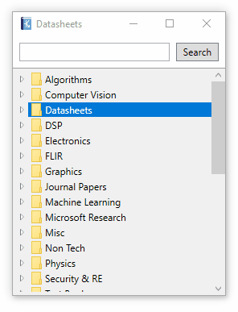
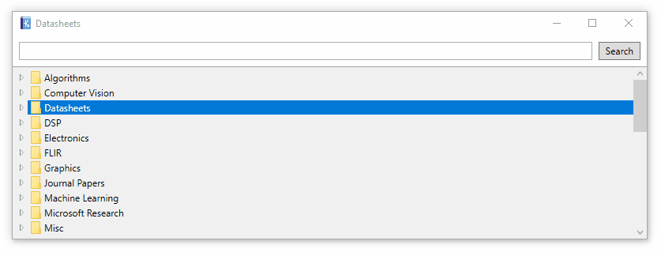

# Datasheets2

Datasheets2 is a simple datasheet/document/PDF organizer that allows you to quickly search 
your collection and open specific files.

This is a port of my original [Datasheets Indexer](https://jared.geek.nz/datasheet-indexer) 
utility, which was written in Delphi/Pascal. I no longer write Pascal, and much prefer 
C#+WPF for my utility apps!

## Usage ##

- Place the executable in a directory containing documents.

- Drag'n'drop documents onto the window to add documents to your library
  (Tip: Hold CTRL to move instead of copy)

- Type your keyword and press ENTER to open the first matching document.

- If no document is found in your library, and you have configured online search,
  the keyword will initiate a search for the datasheet using the configured
  search providers (See below)

By default Datasheets2 does not perform online searches to protect your privacy.

## Configuration ##

You can configure the app by editing `Datasheets2.exe.config`, which should be
placed next to the exe. If you rename the exe, you must also rename this file.

## Octopart Online Search ##

Datasheets2 can search Octopart for datasheets, but to do this you will need to 
[register for your own API key](https://octopart.com/api/home) and enable it in 
your `Datasheets2.exe.config` file:

    <!-- 
      Whether online search should be allowed (true/false)
    -->
    <add key="AllowOnlineSearch" value="true"/>

    <!--
      Third-party search providers to use for datasheet lookup.
      This requires AllowOnlineSearch=true
    -->
    <add key="SearchProviders" value="OctopartAPI"/>
    
    <!--
      If you want to enable the Octopart search provider, you need an API key
    -->
    <add key="OctopartApiKey" value="12345678"/>

You can also enable other online search providers by specifying their names in the 
SearchProviders setting. To see available search providers, look at the 
[default config](/App.config#L56)

